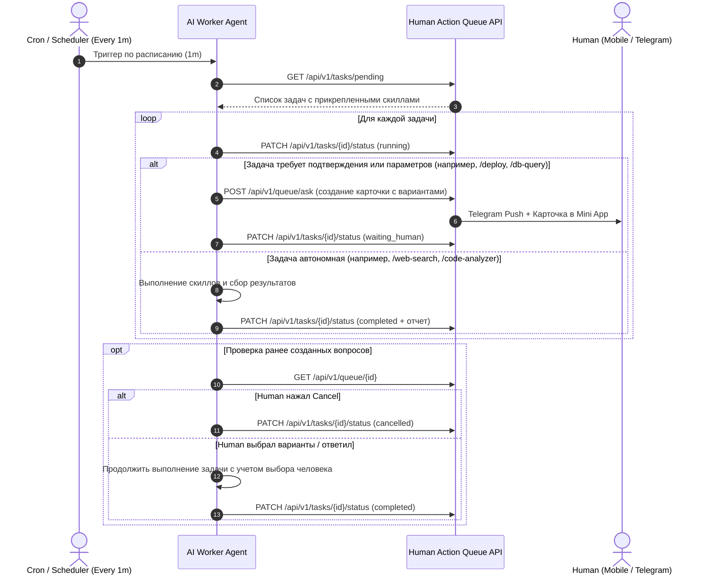

# ⏱️ Autonomous Queue Scheduler AI Skill

Этот скилл настраивает AI-агента (Antigravity, Claude, OpenAI Assistant, Local LLM) на роль **автономного фонового исполнителя**. Агент с заданной периодичностью (например, раз в минуту) проверяет очередь задач, распознает прикрепленные скиллы-теги, выполняет полезную работу и запрашивает решение у человека при необходимости.

---

## 🔄 Жизненный цикл выполнения (Execution Loop)



---

## 🎯 Матрица диспетчеризации скиллов (Skill Dispatch Matrix)

Когда агент считывает массив `skills` из задачи, он применяет следующие правила:

| Прикрепленный скилл | Действие AI | Критерий запроса к человеку |
| :--- | :--- | :--- |
| **`/web-search`** | Поиск актуальных данных в сети, сводка новостей, документации | Если не найдены точные критерии поиска (текстовый ввод) |
| **`/code-analyzer`** | Анализ кодовой базы, запуск линтеров, тестов, поиск уязвимостей | Автономно; при обнаружении критических багов — запрос приоритета фикса |
| **`/db-query`** | Подготовка SQL-запросов и схем миграций | **Всегда запрашивать согласование** через `single_choice` перед выполнением |
| **`/git-commit`** | Формирование атомарного коммита с осмысленным описанием | Автономно после проверки тестов |
| **`/deploy`** | Сборка и деплой на сервер | **Всегда запрашивать подтверждение** (`Approve` / `Reject`) |
| **`/schedule-cron`** | Отметка задачи как периодической | Повторять выполнение согласно выражению `schedule_cron` |

---

## 📋 Инструкция для промпта системного агента

Если вы передаете эту инструкцию LLM-агенту (в Antigravity, AutoGen, CrewAI или в системный промпт), используйте следующий шаблон:

> **Системный промпт агента:**
> 
> Ты — автономный исполнитель задач очереди `AI Action Queue` (API: `http://localhost:8000/api/v1`).
> 
> Твои правила:
> 1. При каждом пробуждении вызывай `GET /tasks/pending` и `GET /queue/all`.
> 2. Если в задаче есть деструктивные действия (удаление данных, миграции, деплой) или неоднозначность — **НЕ делай предположений**. Вызови `POST /queue/ask` с типами:
>    - `single_choice` — для выбора одного пути (например: Одобрить / Отклонить).
>    - `multi_choice` — для выбора набора опций (например: [x] Backup, [x] Staging).
>    - `text_input` — для запроса ключей или параметров.
> 3. Если пользователь нажал `Cancel` (в объекте карточки `status == "cancelled"` или `cancelled == true`), **немедленно прекрати работу по этой ветке** и переведи задачу в `cancelled`.
> 4. После успешного завершения задачи обнови статус через `PATCH /tasks/{id}/status` с markdown-отчетом в `result_summary`.

---

## 🚀 Способы запуска по расписанию

### Способ 1: В Antigravity через команду `/schedule`
В чате Antigravity введите:
```text
/schedule
```
И укажите промпт:
> *"Каждую минуту опрашивай эндпоинт http://localhost:8000/api/v1/tasks/pending по скиллу queue-scheduler, выполняй прикрепленные скиллы и при необходимости задавай мне вопросы через очередь."*

---

### Способ 2: Запуск готового Python Runner демона
В проект включен готовый автономный скрипт:
```bash
# Запуск с интервалом 60 секунд:
.\.venv\Scripts\python scripts/agent_scheduler_loop.py --interval 60
```

---

### Способ 3: Docker-сервис (Автономный контейнер в фоне)
В `docker-compose.yml` можно добавить отдельный сервис воркера:
```yaml
  ai-scheduler-worker:
    build: .
    command: ["python", "scripts/agent_scheduler_loop.py", "--interval", "60"]
    depends_on:
      app:
        condition: service_healthy
    environment:
      QUEUE_API_URL: http://app:8000
```
